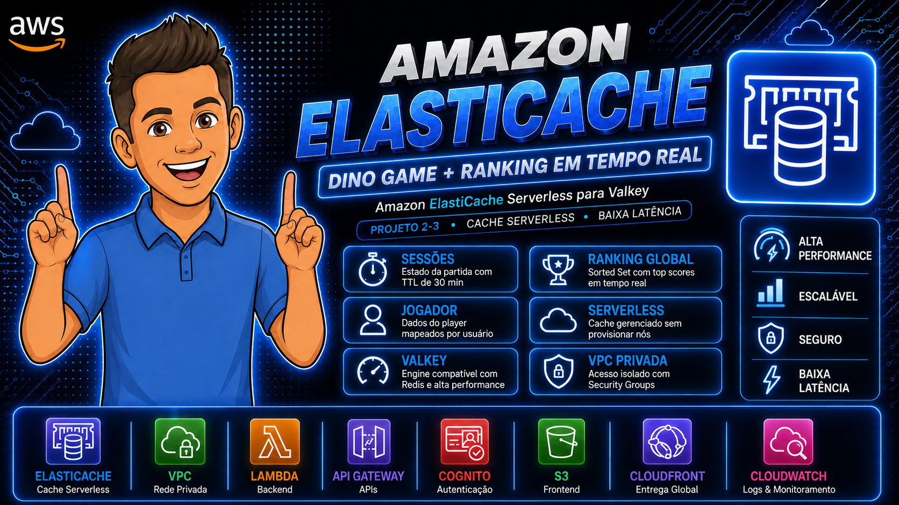
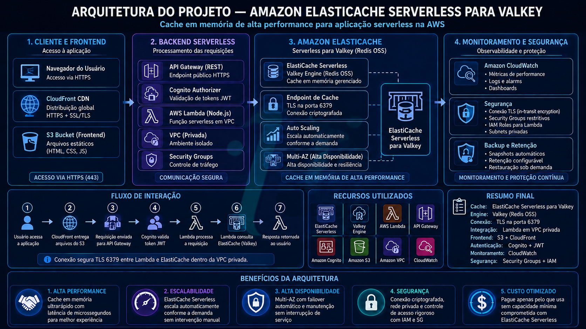
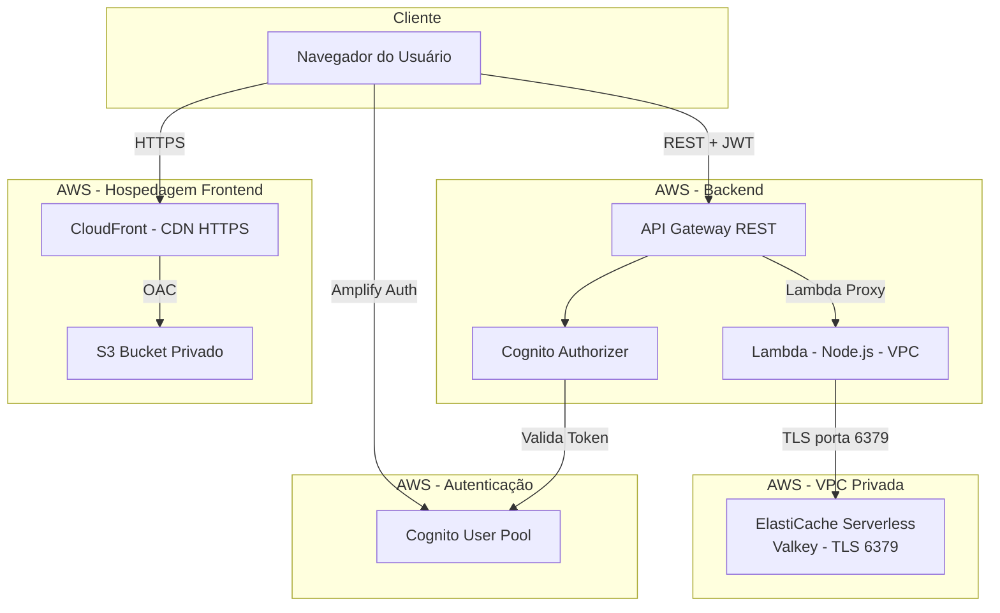
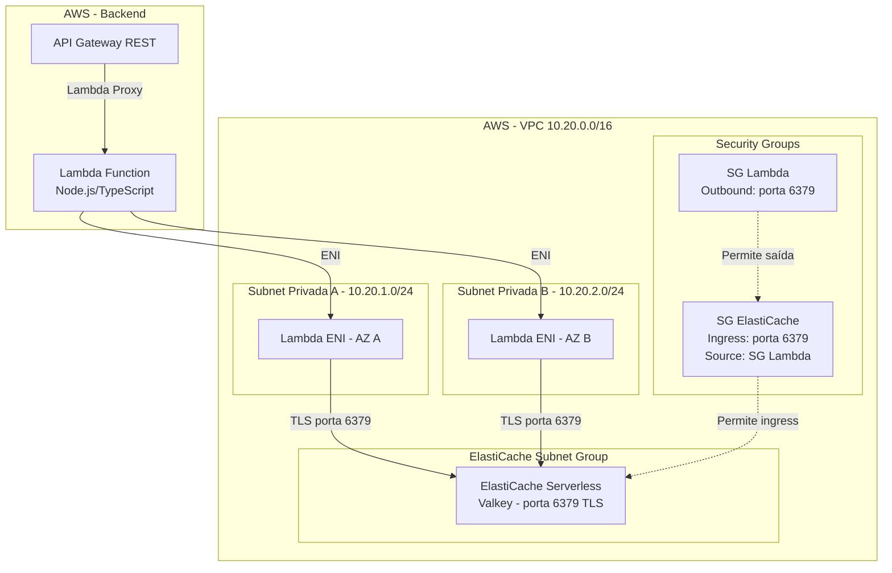
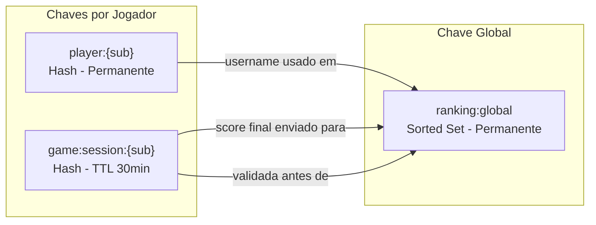
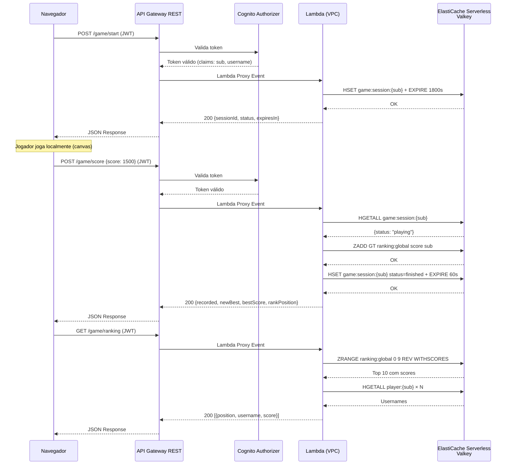

# 🎮 Dino Game — Amazon ElastiCache Serverless para Valkey - Parte 2-3



## Descrição do Projeto

Este é o **Projeto 2** de uma série de laboratórios práticos com serviços AWS. Ele adiciona um **jogo estilo dinossauro do Chrome** à aplicação de autenticação existente (Projeto 1), integrado com **Amazon ElastiCache Serverless para Valkey** como camada de cache de alta performance.

O jogo funciona inteiramente no navegador (canvas HTML5), enquanto o backend gerencia sessões de jogo, ranking global e dados do jogador dentro de uma VPC privada.

> **Pré-requisito:** Este projeto depende da infraestrutura do [Projeto 1 (Dino Login — Amazon Cognito)](https://github.com/<SEU-USUARIO>/AWS-Cognito), que fornece toda a autenticação (Cognito), hospedagem (S3 + CloudFront) e API Gateway já configurados.

### Como o jogo funciona

- **Motor do jogo**: Renderizado em um elemento `<canvas>` HTML5, com game loop usando `requestAnimationFrame`
- **Mecânica**: O jogador controla um dinossauro que deve pular (tecla Espaço ou toque na tela) para desviar de obstáculos (cactos) que se aproximam da direita para a esquerda
- **Progressão**: A velocidade dos obstáculos aumenta gradualmente ao longo do tempo, tornando o jogo progressivamente mais difícil
- **Pontuação**: Calculada com base no número de frames sobrevividos — quanto mais tempo o jogador resistir, maior a pontuação
- **Colisão**: Detecção de colisão por sobreposição de retângulos (hitbox do dinossauro vs. hitbox dos obstáculos)
- **Game over**: A partida termina quando o dinossauro colide com um obstáculo; a pontuação é enviada automaticamente ao backend

A lógica do jogo é **100% local no navegador**, sem dependência de rede durante o gameplay. A comunicação com o backend acontece apenas no início e no fim de cada partida.

<p align="center">
  
  
  
</p>
<p align="center">
  
  
  
</p>

### Integração com ElastiCache Serverless para Valkey

| Funcionalidade | Chave | Tipo | TTL | Descrição |
|----------------|-------|------|-----|-----------|
| **Sessão de jogo** | `game:session:{sub}` | Hash | 30 min | Status da partida (`playing`/`finished`), pontuação e timestamp de início |
| **Ranking global** | `ranking:global` | Sorted Set | Permanente | Melhores pontuações de todos os jogadores. Usa `ZADD GT` para aceitar apenas scores maiores |
| **Dados do jogador** | `player:{sub}` | Hash | Permanente | Mapeia o `sub` do Cognito para o nome de exibição do jogador |

### Operações principais no cache

```
# Iniciar sessão
HSET game:session:{sub} status playing score 0 startedAt <ISO>
EXPIRE game:session:{sub} 1800

# Registrar pontuação (só atualiza se for maior)
ZADD GT ranking:global <score> <sub>

# Top 10 ranking
ZRANGE ranking:global 0 9 REV WITHSCORES

# Posição do jogador
ZREVRANK ranking:global <sub>
```

---

## Diagrama de Arquitetura

### Visão geral



A aplicação segue uma arquitetura **serverless** na AWS. O Projeto 2 adiciona uma VPC com subnets privadas onde a Lambda se conecta ao ElastiCache, mantendo toda a infraestrutura do Projeto 1 (Cognito, CloudFront, S3, API Gateway) inalterada.



### Arquitetura da VPC



### Relacionamento das chaves no cache



---

## Resumo da Infraestrutura

| Componente | CIDR / Configuração | Descrição |
|------------|---------------------|-----------|
| VPC | 10.20.0.0/16 | Virtual Private Cloud dedicada |
| Subnet Privada A | 10.20.1.0/24 | Subnet privada na AZ A (sem Internet Gateway) |
| Subnet Privada B | 10.20.2.0/24 | Subnet privada na AZ B (sem Internet Gateway) |
| Lambda Security Group | Outbound: porta 6379 para SG ElastiCache | Permite Lambda acessar o cache |
| ElastiCache Security Group | Ingress: porta 6379, source: SG Lambda | Restringe acesso ao cache apenas da Lambda |
| ElastiCache Serverless | Valkey, porta 6379, TLS obrigatório | Cache gerenciado sem nodes para provisionar |
| VPC Endpoint | CloudWatch Logs (Interface) | Lambda envia logs sem necessidade de internet |


---

## Benefícios da Arquitetura

| Benefício | Descrição |
|-----------|-----------|
| **Cache sem gerenciamento** | ElastiCache Serverless escala automaticamente, sem nodes para provisionar ou patches para aplicar |
| **Latência ultra-baixa** | Operações no Valkey em sub-milissegundos para ranking e sessões |
| **Segurança por isolamento** | Cache acessível apenas dentro da VPC, via Security Groups restritos |
| **Alta disponibilidade** | Lambda com ENIs em 2 AZs + ElastiCache distribuído automaticamente |
| **Custo sob demanda** | ElastiCache Serverless cobra por ECPU e armazenamento efetivo |
| **Ranking em tempo real** | Sorted Sets garantem ordenação atômica sem processamento adicional |
| **Jogo offline-first** | Lógica do jogo 100% no browser — resiliente a variações de rede |
| **Evolução incremental** | Infraestrutura do Projeto 1 mantida intacta, apenas adicionando novos componentes |


---

## Recursos AWS Utilizados

| Recurso | Função |
|---------|--------|
| **Amazon ElastiCache Serverless (Valkey)** | Cache de alta performance para sessões, ranking e dados do jogador |
| **VPC com subnets privadas** | Isolamento de rede — ElastiCache não acessível pela internet |
| **Security Groups** | Controle de acesso: apenas a Lambda conecta ao cache (porta 6379) |
| **VPC Endpoint (CloudWatch Logs)** | Lambda em VPC envia logs sem acesso à internet |
| **AWS Lambda (VPC)** | Backend serverless com ENIs em 2 AZs para alta disponibilidade |
| **API Gateway (REST)** | Expõe endpoints e valida tokens com Cognito Authorizer |
| **Amazon Cognito** | Autenticação de usuários (herdado do Projeto 1) |
| **Amazon S3 + CloudFront** | Hospedagem do frontend (herdado do Projeto 1) |


---

## Acesso dos Usuários

O acesso à aplicação segue este fluxo:

1. O usuário acessa a URL do CloudFront via **HTTPS**
2. O CloudFront serve os arquivos estáticos do **S3** (bucket privado com OAC)
3. Para jogar, o usuário se autentica via **Cognito** usando o AWS Amplify Auth (protocolo SRP)
4. Após login, o frontend recebe tokens JWT (ID Token, Access Token, Refresh Token)
5. Todas as chamadas à API do jogo incluem o **ID Token** no header `Authorization`
6. O **Cognito Authorizer** do API Gateway valida o token antes de repassar a requisição à Lambda


---

## DNS e Segurança

### HTTPS e Certificados

- Todo tráfego é servido via **HTTPS** (CloudFront redireciona HTTP → HTTPS)
- Certificado SSL gerenciado pelo **AWS Certificate Manager (ACM)**
- Domínio customizado configurado via **Route 53** (herdado do Projeto 1)

### Segurança da VPC

- O ElastiCache **não possui IP público** e não é acessível pela internet
- Subnets privadas sem Internet Gateway — isolamento total
- Comunicação Lambda ↔ ElastiCache criptografada com **TLS obrigatório** na porta 6379
- Security Groups com **princípio do menor privilégio**: apenas a Lambda (via SG) pode acessar o cache

### Segurança da API

- Endpoints protegidos com **Cognito User Pool Authorizer**
- Tokens JWT com expiração de 1 hora (renovados automaticamente via Refresh Token)
- CORS configurado para aceitar apenas origens autorizadas (localhost + domínio CloudFront)

---

## Balanceamento de Carga

Nesta arquitetura serverless, o balanceamento é gerenciado automaticamente pelos serviços AWS:

| Componente | Mecanismo de Balanceamento |
|------------|---------------------------|
| **CloudFront** | Rede global de edge locations — roteia requisições para o PoP mais próximo do usuário |
| **API Gateway** | Gerenciado pela AWS — distribui requisições automaticamente entre instâncias |
| **Lambda (VPC)** | ENIs em 2 Availability Zones (AZ A e AZ B) — se uma AZ falhar, a outra assume |
| **ElastiCache Serverless** | Distribuição automática de dados e conexões entre nós internos, gerenciado pela AWS |

Não há necessidade de configurar ALB/NLB — a arquitetura serverless com Lambda + API Gateway já distribui carga automaticamente.

---

## Computação e Escalabilidade

### AWS Lambda (VPC)

- **Runtime:** Node.js com TypeScript compilado
- **Padrão:** Monolítica (uma Lambda para todos os endpoints do jogo)
- **Memória:** Configurável (128 MB a 10 GB)
- **Timeout:** Configurável (até 15 min, mas respostas da API em < 1s)
- **Concorrência:** Escalabilidade automática — novas instâncias criadas sob demanda
- **VPC:** ENIs em 2 subnets privadas para acesso ao ElastiCache
- **Cold start:** Minimizado com conexão singleton ao cache (reutilizada entre invocações quentes)

### ElastiCache Serverless

- **Engine:** Valkey (compatível com Redis)
- **Escalabilidade:** Automática — sem necessidade de provisionar nodes ou definir tipo de instância
- **Cobrança:** Por ECPU (ElastiCache Processing Units) consumidas + armazenamento efetivo
- **Disponibilidade:** Multi-AZ automático, gerenciado pela AWS

### API Gateway

- **Tipo:** REST API (Regional)
- **Throttling:** Configurável por stage e por endpoint
- **Stage:** dev
- **Escalabilidade:** Gerenciada pela AWS — sem limite prático para este tipo de aplicação


---

## Fluxo do Processamento

### Fluxo completo de uma partida




### Endpoints da API

Todos os endpoints requerem autenticação (token JWT do Cognito no header `Authorization`).

| Método | Endpoint | Descrição | Respostas |
|--------|----------|-----------|-----------|
| `POST` | `/game/start` | Inicia uma nova sessão de jogo | 200: `{sessionId, status, expiresIn}` · 401 · 503 |
| `POST` | `/game/score` | Registra a pontuação final da partida | 200: `{recorded, newBest, bestScore, rankPosition}` · 400 · 401 · 409 · 503 |
| `GET` | `/game/ranking` | Retorna o top 10 jogadores | 200: `[{position, username, score}]` · 503 |
| `GET` | `/game/me` | Dados do jogador atual | 200: `{username, bestScore, session}` · 401 · 503 |
| `GET` | `/game/status` | Verifica disponibilidade do jogo e cache | 200: `{game, cache}` |

---

## Conceitos Demonstrados

### Infraestrutura e Rede
- Configuração de **VPC com subnets privadas** sem Internet Gateway
- Criação de **Security Groups** com princípio do menor privilégio
- **VPC Endpoints** (Interface) para comunicação com serviços AWS sem internet
- **Lambda em VPC** com ENIs em múltiplas Availability Zones

### Cache e Dados
- **Amazon ElastiCache Serverless** — provisionamento automático sem gerenciar clusters
- **Sorted Sets** para ranking com atualização atômica (`ZADD GT`)
- **Hashes com TTL** para sessões de jogo com expiração automática (`HSET` + `EXPIRE`)
- **Conexão TLS** entre Lambda e ElastiCache na porta 6379
- **Padrão Singleton** para reutilização de conexão entre invocações quentes

### Aplicação
- **Canvas HTML5** com game loop (`requestAnimationFrame`) e detecção de colisão
- **Arquitetura offline-first** — jogo funciona sem rede, comunica apenas início e fim
- **JWT para autorização** — Cognito Authorizer valida tokens sem código customizado
- **Lambda monolítica** com roteamento interno para múltiplos endpoints

### Segurança
- **Isolamento de rede** — ElastiCache inacessível pela internet
- **TLS obrigatório** em todas as conexões com o cache
- **CORS restritivo** — apenas origens autorizadas
- **Tokens com expiração** — ID Token válido por 1 hora, Refresh Token por 30 dias


---

## Estrutura de Diretórios

```
Amazon-Elasticache/
├── src/                          # Código-fonte do frontend (React)
│   ├── components/               # Componentes reutilizáveis
│   │   ├── LoadingSpinner/       # Indicador de carregamento
│   │   ├── PasswordInput/        # Campo de senha com toggle
│   │   ├── PrivateRoute/         # Protege rotas autenticadas
│   │   ├── PublicRoute/          # Redireciona logados
│   │   └── ErrorMessage/         # Exibição padronizada de erros
│   ├── pages/                    # Páginas da aplicação
│   │   ├── HomePage/             # Página inicial
│   │   ├── LoginPage/            # Tela de login
│   │   ├── RegisterPage/         # Tela de cadastro
│   │   ├── ConfirmEmailPage/     # Confirmação de email
│   │   ├── ForgotPasswordPage/   # Recuperação de senha
│   │   ├── DashboardPage/        # Área autenticada
│   │   ├── GamePage/             # 🎮 Página do jogo (canvas + ranking)
│   │   └── ProfilePage/          # Perfil do usuário
│   ├── contexts/                 # Estado global (AuthContext)
│   ├── hooks/                    # Hooks customizados
│   ├── App.tsx                   # Componente raiz
│   └── main.tsx                  # Entry point
├── backend/                      # Código-fonte do backend (Lambda)
│   ├── src/
│   │   ├── index.ts              # Handler principal (roteamento)
│   │   ├── routes/               # Handlers dos endpoints
│   │   │   ├── health.ts         # GET /health
│   │   │   ├── me.ts             # GET /me
│   │   │   ├── gameStart.ts      # POST /game/start
│   │   │   ├── gameScore.ts      # POST /game/score
│   │   │   ├── gameRanking.ts    # GET /game/ranking
│   │   │   ├── gameMe.ts         # GET /game/me
│   │   │   └── gameStatus.ts     # GET /game/status
│   │   ├── services/
│   │   │   └── cacheService.ts   # Conexão e operações com ElastiCache
│   │   ├── utils/                # CORS, response builder, logger
│   │   └── types/                # Tipos TypeScript
│   ├── package.json
│   └── tsconfig.json
├── ARQUITETURA.md                # Detalhes técnicos e diagramas completos
├── IMPLANTACAO-AWS.md            # Guia de implantação na AWS
└── README.md                     # Este arquivo
```

---

## Como executar localmente

### Variáveis de ambiente

O projeto usa variáveis de ambiente para conectar aos serviços AWS. Copie o template e preencha:

```bash
cp .env.example .env
```

| Variável | Descrição | Onde encontrar |
|----------|-----------|----------------|
| `VITE_COGNITO_USER_POOL_ID` | ID do User Pool do Cognito | Console AWS > Cognito > User Pool > "ID do grupo de usuários" |
| `VITE_COGNITO_USER_POOL_CLIENT_ID` | ID do App Client | Console AWS > Cognito > User Pool > Integração de aplicativos > "ID do cliente" |
| `VITE_API_URL` | URL base da API Gateway (sem `/` final) | Console AWS > API Gateway > Estágios > dev > "Invocar URL" |

> O `.env` está no `.gitignore` e **nunca deve ser commitado**. Cada ambiente deve criar o seu a partir do `.env.example`.

### Frontend (funciona sem AWS)

```bash
npm install
npm run dev
```

O jogo (motor canvas) funciona 100% localmente. As chamadas à API falharão sem o backend configurado, mas é possível testar a mecânica do jogo, a interface de ranking e a navegação.

### Backend (requer AWS)

```bash
cd backend
npm install
npm run build    # Compila TypeScript
npm run test     # Executa testes unitários
```

> **Nota:** O ElastiCache Serverless não possui emulador local oficial. Para testar a integração completa, é necessário a infraestrutura AWS do Projeto 1 implantada + os recursos do Projeto 2 (VPC, ElastiCache, Security Groups). Consulte o [IMPLANTACAO-AWS.md](./IMPLANTACAO-AWS.md).

---

## Decisões de Design

| Decisão | Escolha | Justificativa |
|---------|---------|---------------|
| Cache Engine | ElastiCache Serverless para Valkey | Compatível com Redis, sem gerenciamento de nodes, escala automática, custo sob demanda |
| Rede | VPC com subnets privadas | ElastiCache só é acessível de dentro da VPC, segurança por isolamento |
| Conexão TLS | Porta 6379 com TLS obrigatório | ElastiCache Serverless exige TLS em todas as conexões |
| Padrão de conexão | Singleton com reconnect strategy | Reutiliza conexão entre invocações quentes da Lambda |
| Atualização de ranking | `ZADD GT` | Atualiza apenas quando o novo score é maior que o existente |
| Lógica do jogo | 100% local no browser (canvas) | Evita latência de rede durante gameplay |
| Lambda em VPC | ENIs em 2 subnets privadas | Alta disponibilidade (multi-AZ) e acesso direto ao ElastiCache |
| Security Groups | SG Lambda → SG Cache (porta 6379) | Princípio do menor privilégio |

---

## Documentação Adicional

- [IMPLANTACAO-AWS.md](./IMPLANTACAO-AWS.md) — Guia de implantação incluindo VPC, ElastiCache e Security Groups
- [ARQUITETURA.md](./ARQUITETURA.md) — Diagramas e detalhes técnicos da arquitetura completa (Projetos 1 e 2)
